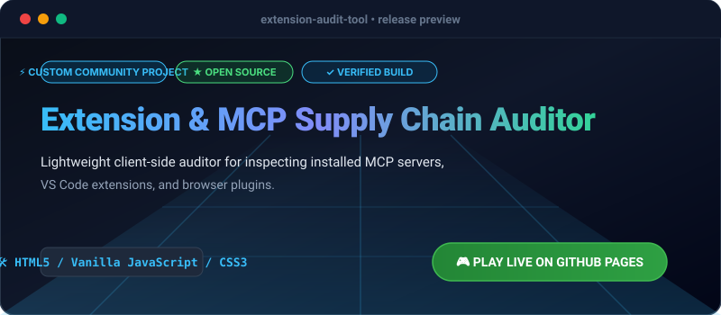

# Extension & MCP Supply Chain Auditor

> 🚀 **v1.3.0 Release:** Batch manifest analysis, advanced filtering, and persistent local audit tracking.

## Core Features

- **Deep Manifest Inspection**: Comprehensive auditing of Model Context Protocol (MCP) server configurations and browser extension manifests.
- **Batch Processing**: Simultaneous analysis of multiple configuration files for enterprise-grade supply chain visibility.
- **Advanced Filtering**: Rapidly query assets by risk tier, command type, or suspicious environment flag.
- **Executive Compliance Scoring**: Quantitative hardening metrics mapped directly to actionable risk remediations.
- **Multi-Format Export**: Export audit findings as JSON, CSV, or standalone HTML executive summaries.